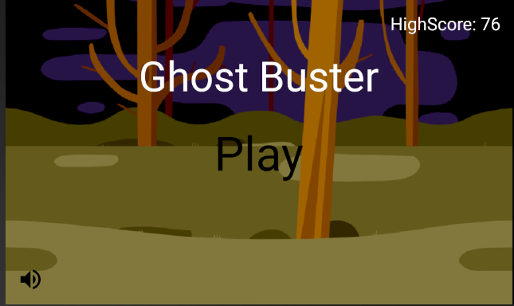

## Ghost Buster

### INTRODUCTION
Ghost Buster is a shooting game. Player needs to shoot the randomly appeared ghosts and avoid hitting the ghosts by moving away. Shooting a ghost earns one point while being hit by a ghost causes the game to be over. There is a predefined time limit for the game which is currently set as 60s. High score is logged and displayed in the main screen.  

There are two views in the game, i.e. Main View and Game View. Main View consists of a Play button, Volume Control button and a High Score text. Tapping Play button starts the game and transition into Game View. Tapping Volume Control button toggles music to be on and off. High Score text displays current high score. Please refer to figure 1 below.  

Game View consists of the Player icon, randomly appearing Ghost icons, counting down timer text, Current Score text and Current High Score text on a moving dark woods background. Different ghosts will appear and move towards the Player. Player can move up or down by tapping areas above or below himself to avoid being hit by the ghost. Player can also shoot the ghost by tapping areas to his right. A shot ghost will disappear, and the player’s point is increased by one. Current high score will be updated with the score exceeds it. At the same time, the timer text is being counted down from predefined time limit. The game is over if the player is being hit or the time is up. The following figures display various scenarios of the game. Please refer to figure 2, 3 and 4 below for Game View.  

### APPLICATION DETAILS
Figure below shows the summary of the application.

The 3 main classes in this project are *MainActivity.java*, *GameActivity.java* and *GameView.java* with a layout file *activity_main.xml* used for Main View. Other supporting classes are *Background.java*, *Bullet.java*, *Ghost.java* and *Player.java*.

*Background.java* loads the woods image which is used as the background of both Main View and Game View. *Bullet.java* provides Game View with the bullets when user shoots by tapping on the right of Player icon. *Ghost.java* provides Game View with the different Ghost images while *Player.java* provides Game View with variations of Player images.
The game starts with Main View which is handled by *MainActivity.java*. Audio for Game View is toggled ON/OFF by tapping on the Volume Control control located at lower left corner. Tapping Play button starts Game Activity which loads *GameView.java*.

*GameView.java* extends *SurfaceView* and implements *Runnable* to make use of Thread. The background of Game View with Player’s movements and shooting, Ghost icons, Score, count down Timer and High Score text are repeatedly redrawn on canvas in a loop. Different parameters like width, height, x position and positions of the views mentioned in previous sentence are updated repeated in loop. These parameters are changed based on different scenarios like player being hit by ghost, player shooting, time’s up and etc. The game is over if the time’s up or player being hit by ghost.  

### BUILDING AND RUNNING THE APP
    1. Download and unzip GhostBuster.zip.
    2. Open the GhostBuster project from the downloaded folder.
  
    3. Press Ctrl+F9 or Build->Make Project to build the project.  
  
    4. In the device, navigate to Download folder to look for the app.  
  
    5. Press INSTALL to install the app.  
  
    6. Ghost Buster app will appear on your device. Tap on it to start the game. Have Fun!
  

### FUTURE WORKS  
    1. Improving the graphical elements in different scenarios for Player icon, Ghost icons, backgrounds and etc.
    2. Incorporating levels to the game with increasing difficulty and complexity.
    3. Pausing and Resuming of the game.
    4. Incorporating social media features.
    5. Adding customization like avatar choice, different time limits, localization and background choice. 

### RESOURCES AND REFERENCES
1. <https://icons8.com>
2. <https://developer.android.com>
3. <https://stackoverflow.com/questions/20915266/error-type-3-error-activity-class-does-not-exist>
4. <https://www.androidpit.com/android-for-beginners-what-is-an-apk-file>
    

